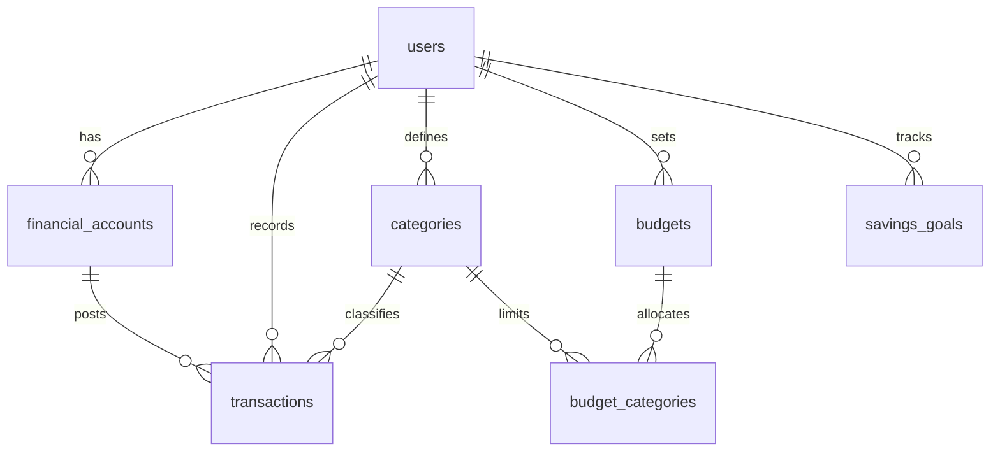

# Finsight AI Prototype

## Schema Design (Django ORM / Relational)

This repository currently contains a frontend prototype (mocked data in the UI). The schema below is a proposed backend data model that supports the current screens (auth, transactions, budgets, goals).



### Django models.py (reference)

```python
import uuid

from django.conf import settings
from django.contrib.auth.models import AbstractUser
from django.db import models


class User(AbstractUser):
    id = models.UUIDField(primary_key=True, default=uuid.uuid4, editable=False)
    full_name = models.CharField(max_length=200)
    email = models.EmailField(unique=True)
    locale = models.CharField(max_length=16, default="en-NG")

    USERNAME_FIELD = "email"
    REQUIRED_FIELDS = []


class TimestampedModel(models.Model):
    created_at = models.DateTimeField(auto_now_add=True)
    updated_at = models.DateTimeField(auto_now=True)

    class Meta:
        abstract = True


class CategoryKind(models.TextChoices):
    INCOME = "income", "Income"
    EXPENSE = "expense", "Expense"
    TRANSFER = "transfer", "Transfer"


class Category(models.Model):
    id = models.UUIDField(primary_key=True, default=uuid.uuid4, editable=False)
    user = models.ForeignKey(
        settings.AUTH_USER_MODEL,
        on_delete=models.CASCADE,
        null=True,
        blank=True,
        related_name="categories",
    )
    name = models.CharField(max_length=100)
    kind = models.CharField(max_length=16, choices=CategoryKind.choices)
    is_system = models.BooleanField(default=False)

    class Meta:
        constraints = [
            models.UniqueConstraint(fields=["user", "name"], name="uniq_user_category_name"),
        ]


class FinancialAccount(TimestampedModel):
    id = models.UUIDField(primary_key=True, default=uuid.uuid4, editable=False)
    user = models.ForeignKey(settings.AUTH_USER_MODEL, on_delete=models.CASCADE, related_name="financial_accounts")
    institution_name = models.CharField(max_length=200)
    account_type = models.CharField(max_length=32)
    currency = models.CharField(max_length=3)
    balance_current_minor = models.BigIntegerField(default=0)
    balance_available_minor = models.BigIntegerField(null=True, blank=True)


class TransactionStatus(models.TextChoices):
    PENDING = "pending", "Pending"
    COMPLETED = "completed", "Completed"
    REVERSED = "reversed", "Reversed"


class Transaction(TimestampedModel):
    id = models.UUIDField(primary_key=True, default=uuid.uuid4, editable=False)
    user = models.ForeignKey(settings.AUTH_USER_MODEL, on_delete=models.CASCADE, related_name="transactions")
    account = models.ForeignKey(FinancialAccount, on_delete=models.CASCADE, related_name="transactions")
    category = models.ForeignKey(Category, on_delete=models.SET_NULL, null=True, blank=True, related_name="transactions")
    merchant_name = models.CharField(max_length=200)
    description = models.TextField(blank=True)
    amount_minor = models.BigIntegerField()
    currency = models.CharField(max_length=3)
    status = models.CharField(max_length=16, choices=TransactionStatus.choices, default=TransactionStatus.COMPLETED)
    booked_at = models.DateTimeField()

    class Meta:
        indexes = [
            models.Index(fields=["user", "-booked_at"]),
            models.Index(fields=["user", "category", "booked_at"]),
            models.Index(fields=["account", "booked_at"]),
        ]


class Budget(TimestampedModel):
    id = models.UUIDField(primary_key=True, default=uuid.uuid4, editable=False)
    user = models.ForeignKey(settings.AUTH_USER_MODEL, on_delete=models.CASCADE, related_name="budgets")
    period_start = models.DateField()
    period_end = models.DateField()
    currency = models.CharField(max_length=3)
    total_limit_minor = models.BigIntegerField(null=True, blank=True)
    categories = models.ManyToManyField(Category, through="BudgetCategory", related_name="budgets")


class BudgetCategory(models.Model):
    budget = models.ForeignKey(Budget, on_delete=models.CASCADE)
    category = models.ForeignKey(Category, on_delete=models.CASCADE)
    limit_minor = models.BigIntegerField()

    class Meta:
        constraints = [
            models.UniqueConstraint(fields=["budget", "category"], name="uniq_budget_category"),
        ]


class SavingsGoalStatus(models.TextChoices):
    ACTIVE = "active", "Active"
    COMPLETED = "completed", "Completed"
    PAUSED = "paused", "Paused"


class SavingsGoal(TimestampedModel):
    id = models.UUIDField(primary_key=True, default=uuid.uuid4, editable=False)
    user = models.ForeignKey(settings.AUTH_USER_MODEL, on_delete=models.CASCADE, related_name="savings_goals")
    name = models.CharField(max_length=120)
    target_minor = models.BigIntegerField()
    current_minor = models.BigIntegerField(default=0)
    currency = models.CharField(max_length=3)
    due_date = models.DateField(null=True, blank=True)
    status = models.CharField(max_length=16, choices=SavingsGoalStatus.choices, default=SavingsGoalStatus.ACTIVE)
```

Notes:

- Amounts are stored as integers in minor units (kobo/cents) via `*_minor` fields.
- Transaction categories can be system-wide (`user=null`, `is_system=true`) or user-defined (`user=<owner>`, `is_system=false`).
- Keep system category names unique in seed data.
- If you use the custom `User` shown above, configure `AUTH_USER_MODEL` to point to it; otherwise remove that model and keep using `settings.AUTH_USER_MODEL` for foreign keys.
