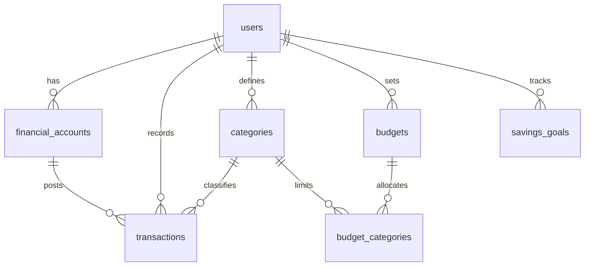

# Finsight AI - Personal Finance Management Platform

🚀 **AI-powered personal finance platform for Nigerian users with bank account integration, transaction analysis, and intelligent financial insights.**

[](https://www.djangoproject.com/)
[](https://nextjs.org/)
[](https://www.docker.com/)
[](https://redis.io/)
[]()

## 📋 Table of Contents
- [Quick Start](#-quick-start-with-docker)
- [Features](#-features)
- [Architecture](#-architecture)
- [Development Setup](#-development-setup)
- [Testing](#-testing)
- [Caching Strategy](#-caching-strategy)
- [Logging](#-logging)
- [Security](#-security)
- [API Documentation](#-api-documentation)
- [Production Deployment](#-production-deployment)

## 🐳 Quick Start with Docker

### Prerequisites
- Docker and Docker Compose installed
- Ports 3000 and 8000 available

### Deploy the Application
```bash
# 1. Copy environment template (if needed)
cp backend/.env.example backend/.env
# Edit backend/.env with your API keys if different

# 2. Build and start all services
docker-compose up --build

# Access the application
# Frontend: http://localhost:3000
# Backend API: http://localhost:8000

# Demo credentials:
# Email: test2@example.com
# Password: testpassword123
```

## ✨ Features

- 🏦 **Bank Integration**: Connect Nigerian banks via Mono Connect
- 🤖 **AI Financial Intelligence**: DeepSeek V4 Flash analysis with 85+ data points
- 📊 **Real-time Dashboard**: Live balance, transactions, spending analytics
- 💬 **AI Assistant**: Natural language financial queries
- 🎯 **Smart Insights**: Predictive analytics, risk assessment, personalized recommendations
- 📱 **Mobile-ready**: Responsive design with modern UI
- 🔐 **Secure**: Session-based auth, CSRF protection, environment variables
- ⚡ **Performance**: Redis caching, optimized queries, Docker deployment
- 📝 **Comprehensive Logging**: Structured logging with multiple handlers
- 🧪 **Well-tested**: Unit and integration tests for backend

## 🏗️ Architecture

### Technology Stack

**Frontend:**
- Next.js 14.2.35 (React 19)
- TypeScript 5.x
- Tailwind CSS 4.1.9
- Radix UI Components

**Backend:**
- Django 6.0.4
- Django REST Framework
- SQLite (development) / PostgreSQL (production)
- Redis 7 (caching)

**Infrastructure:**
- Docker & Docker Compose
- Nginx (reverse proxy)
- Gunicorn (WSGI server)

**External Services:**
- Mono API (Nigerian bank integration)
- DeepSeek AI (financial intelligence)

## 💻 Development Setup

### Prerequisites
- Python 3.14+
- Node.js 18+
- Docker and Docker Compose
- Redis (optional for local development)

### Local Development (Without Docker)

#### Backend Setup
```bash
cd backend
python -m venv venv
source venv/bin/activate  # On Windows: venv\Scripts\activate
pip install -r requirements.txt
python manage.py migrate
python manage.py createsuperuser
python manage.py runserver
```

#### Frontend Setup
```bash
cd frontend
yarn install  # or npm install
yarn dev  # or npm run dev
```

### Environment Variables

#### Backend (.env)
```env
SECRET_KEY=your-secret-key-here
DEBUG=True
ALLOWED_HOSTS=localhost,127.0.0.1
MONO_SECRET_KEY=your-mono-secret-key
MONO_PUBLIC_KEY=your-mono-public-key
DEEPSEEK_API_KEY=your-deepseek-api-key
REDIS_HOST=redis
REDIS_PORT=6379
```

#### Frontend (.env.local)
```env
NEXT_PUBLIC_API_BASE_URL=http://localhost:8000
```

## 🧪 Testing

### Running Backend Tests
```bash
cd backend
python manage.py test

# Run with coverage
coverage run --source='.' manage.py test
coverage report

# Run specific test
python manage.py test core.tests.UserModelTestCase
```

### Test Categories
- **Unit Tests**: Models, serializers, utilities
- **Integration Tests**: API endpoints, authentication flow
- **Performance Tests**: Caching, query optimization

### Frontend Testing
```bash
cd frontend
yarn test  # or npm test
yarn test:coverage  # or npm run test:coverage
```

## ⚡ Caching Strategy

### Redis Configuration
The application uses Redis for caching frequently accessed data:

```python
# Cached items with TTL:
- User transactions: 5 minutes
- AI responses: 1 hour
- Financial summaries: 10 minutes
- Dashboard data: 5 minutes
```

### Cache Implementation
```python
from core.cache_utils import (
    cache_user_transactions,
    get_cached_transactions,
    cache_ai_response,
    get_cached_ai_response,
    invalidate_user_cache
)

# Example usage in views
cached_data = get_cached_transactions(user.id)
if not cached_data:
    # Fetch from database
    transactions = Transaction.objects.filter(user=user)
    cache_user_transactions(user.id, transactions)
```

### Cache Invalidation
- Automatic invalidation on data updates
- Manual invalidation via management commands
- TTL-based expiration

## 📝 Logging

### Configuration
Structured logging with multiple handlers:

- **Console Handler**: INFO level, simple format
- **File Handler**: All logs to `logs/django.log` (15MB rotation)
- **Error File Handler**: ERROR level to `logs/django_errors.log`

### Log Levels
```python
DEBUG: Detailed information for diagnosing problems
INFO: General informational messages
WARNING: Warning messages
ERROR: Error messages
CRITICAL: Critical problems
```

### Usage
```python
import logging
logger = logging.getLogger(__name__)

logger.info(f"User {user.id} connected bank account")
logger.error(f"Failed to fetch transactions: {error}")
logger.debug(f"Cache hit for user {user.id}")
```

## 🔐 Security

### Implemented Security Measures
- ✅ Session-based authentication
- ✅ CSRF protection (Django middleware)
- ✅ XSS prevention (template auto-escape)
- ✅ SQL injection protection (ORM)
- ✅ Environment variables for secrets
- ✅ CORS configuration
- ✅ Password hashing (PBKDF2)
- ✅ HTTPS-ready with Nginx

### Security Headers (Nginx)
```nginx
add_header X-Frame-Options "SAMEORIGIN" always;
add_header X-XSS-Protection "1; mode=block" always;
add_header X-Content-Type-Options "nosniff" always;
add_header Referrer-Policy "no-referrer-when-downgrade" always;
```

## 📚 API Documentation

### Authentication Endpoints
| Method | Endpoint | Description |
|--------|----------|-------------|
| POST | `/api/auth/register/` | User registration |
| POST | `/api/auth/login/` | User login |
| POST | `/api/auth/logout/` | User logout |
| GET | `/api/auth/me/` | Get current user |
| POST | `/api/auth/change-password/` | Change password |

### Financial Endpoints
| Method | Endpoint | Description |
|--------|----------|-------------|
| GET | `/api/accounts/` | List financial accounts |
| POST | `/api/mono/exchange/` | Connect bank account |
| GET | `/api/transactions/` | List transactions |
| GET | `/api/categories/` | List categories |
| POST | `/api/budgets/` | Create budget |
| POST | `/api/savings-goals/` | Create savings goal |

### AI Endpoints
| Method | Endpoint | Description |
|--------|----------|-------------|
| POST | `/api/ai/chat/` | Chat with AI assistant |
| GET | `/api/ai/financial-intelligence/` | Get AI analysis |

### Example Request
```bash
curl -X POST http://localhost:8000/api/ai/chat/ \
  -H "Content-Type: application/json" \
  -H "Cookie: sessionid=your-session-id" \
  -d '{"question": "What are my spending patterns?"}'
```

## Schema Design (Django ORM / Relational)

This repository currently contains a frontend prototype (mocked data in the UI). The schema below is a proposed backend data model that supports the current screens (auth, transactions, budgets, goals).


```mermaid
erDiagram
  users ||--o{ financial_accounts : has
  users ||--o{ transactions : records
  users ||--o{ categories : defines
  financial_accounts ||--o{ transactions : posts
  categories ||--o{ transactions : classifies
  users ||--o{ budgets : sets
  budgets ||--o{ budget_categories : allocates
  categories ||--o{ budget_categories : limits
  users ||--o{ savings_goals : tracks
```

### Django models.py (reference)

```python
import uuid

from django.conf import settings
from django.contrib.auth.models import AbstractUser
from django.db import models


class User(AbstractUser):
    id = models.UUIDField(primary_key=True, default=uuid.uuid4, editable=False)
    full_name = models.CharField(max_length=200)
    email = models.EmailField(unique=True)
    locale = models.CharField(max_length=16, default="en-NG")

    USERNAME_FIELD = "email"
    REQUIRED_FIELDS = []


class TimestampedModel(models.Model):
    created_at = models.DateTimeField(auto_now_add=True)
    updated_at = models.DateTimeField(auto_now=True)

    class Meta:
        abstract = True


class CategoryKind(models.TextChoices):
    INCOME = "income", "Income"
    EXPENSE = "expense", "Expense"
    TRANSFER = "transfer", "Transfer"


class Category(models.Model):
    id = models.UUIDField(primary_key=True, default=uuid.uuid4, editable=False)
    user = models.ForeignKey(
        settings.AUTH_USER_MODEL,
        on_delete=models.CASCADE,
        null=True,
        blank=True,
        related_name="categories",
    )
    name = models.CharField(max_length=100)
    kind = models.CharField(max_length=16, choices=CategoryKind.choices)
    is_system = models.BooleanField(default=False)

    class Meta:
        constraints = [
            models.UniqueConstraint(fields=["user", "name"], name="uniq_user_category_name"),
        ]


class FinancialAccount(TimestampedModel):
    id = models.UUIDField(primary_key=True, default=uuid.uuid4, editable=False)
    user = models.ForeignKey(settings.AUTH_USER_MODEL, on_delete=models.CASCADE, related_name="financial_accounts")
    institution_name = models.CharField(max_length=200)
    account_type = models.CharField(max_length=32)
    currency = models.CharField(max_length=3)
    balance_current_minor = models.BigIntegerField(default=0)
    balance_available_minor = models.BigIntegerField(null=True, blank=True)


class TransactionStatus(models.TextChoices):
    PENDING = "pending", "Pending"
    COMPLETED = "completed", "Completed"
    REVERSED = "reversed", "Reversed"


class Transaction(TimestampedModel):
    id = models.UUIDField(primary_key=True, default=uuid.uuid4, editable=False)
    user = models.ForeignKey(settings.AUTH_USER_MODEL, on_delete=models.CASCADE, related_name="transactions")
    account = models.ForeignKey(FinancialAccount, on_delete=models.CASCADE, related_name="transactions")
    category = models.ForeignKey(Category, on_delete=models.SET_NULL, null=True, blank=True, related_name="transactions")
    merchant_name = models.CharField(max_length=200)
    description = models.TextField(blank=True)
    amount_minor = models.BigIntegerField()
    currency = models.CharField(max_length=3)
    status = models.CharField(max_length=16, choices=TransactionStatus.choices, default=TransactionStatus.COMPLETED)
    booked_at = models.DateTimeField()

    class Meta:
        indexes = [
            models.Index(fields=["user", "-booked_at"]),
            models.Index(fields=["user", "category", "booked_at"]),
            models.Index(fields=["account", "booked_at"]),
        ]


class Budget(TimestampedModel):
    id = models.UUIDField(primary_key=True, default=uuid.uuid4, editable=False)
    user = models.ForeignKey(settings.AUTH_USER_MODEL, on_delete=models.CASCADE, related_name="budgets")
    period_start = models.DateField()
    period_end = models.DateField()
    currency = models.CharField(max_length=3)
    total_limit_minor = models.BigIntegerField(null=True, blank=True)
    categories = models.ManyToManyField(Category, through="BudgetCategory", related_name="budgets")


class BudgetCategory(models.Model):
    budget = models.ForeignKey(Budget, on_delete=models.CASCADE)
    category = models.ForeignKey(Category, on_delete=models.CASCADE)
    limit_minor = models.BigIntegerField()

    class Meta:
        constraints = [
            models.UniqueConstraint(fields=["budget", "category"], name="uniq_budget_category"),
        ]


class SavingsGoalStatus(models.TextChoices):
    ACTIVE = "active", "Active"
    COMPLETED = "completed", "Completed"
    PAUSED = "paused", "Paused"


class SavingsGoal(TimestampedModel):
    id = models.UUIDField(primary_key=True, default=uuid.uuid4, editable=False)
    user = models.ForeignKey(settings.AUTH_USER_MODEL, on_delete=models.CASCADE, related_name="savings_goals")
    name = models.CharField(max_length=120)
    target_minor = models.BigIntegerField()
    current_minor = models.BigIntegerField(default=0)
    currency = models.CharField(max_length=3)
    due_date = models.DateField(null=True, blank=True)
    status = models.CharField(max_length=16, choices=SavingsGoalStatus.choices, default=SavingsGoalStatus.ACTIVE)
```

Notes:

- Amounts are stored as integers in minor units (kobo/cents) via `*_minor` fields.
- Transaction categories can be system-wide (`user=null`, `is_system=true`) or user-defined (`user=<owner>`, `is_system=false`).
- Keep system category names unique in seed data.
- If you use the custom `User` shown above, configure `AUTH_USER_MODEL` to point to it; otherwise remove that model and keep using `settings.AUTH_USER_MODEL` for foreign keys.

## 🚀 Production Deployment

### Using Docker Compose (Recommended)

```bash
# Build and start all services
docker-compose up --build -d

# View logs
docker-compose logs -f

# Stop services
docker-compose down
```

### Services Running
- **Frontend**: http://localhost:3000
- **Backend API**: http://localhost:8000
- **Nginx**: http://localhost:80
- **Redis**: localhost:6379

### Production Configuration

1. **Update environment variables** for production
2. **Use PostgreSQL** instead of SQLite
3. **Enable HTTPS** with SSL certificates
4. **Configure domain names** in Nginx
5. **Set DEBUG=False** in Django settings
6. **Use production builds** for frontend

### Scaling Considerations

- Use Redis Cluster for high availability
- Implement database connection pooling
- Use CDN for static assets
- Implement rate limiting
- Add monitoring (Prometheus, Grafana)
- Use container orchestration (Kubernetes)

## 📊 Code Quality

### Linting

#### Backend (Python)
```bash
# Install linters
pip install flake8 black isort

# Run linters
flake8 backend/
black backend/
isort backend/
```

#### Frontend (TypeScript/JavaScript)
```bash
# Run ESLint
cd frontend
yarn lint  # or npm run lint
```

### Pre-commit Hooks
```bash
# Install pre-commit
pip install pre-commit

# Setup hooks
pre-commit install
```

## 🤝 Contributing

1. Fork the repository
2. Create a feature branch (`git checkout -b feature/AmazingFeature`)
3. Commit changes (`git commit -m 'Add AmazingFeature'`)
4. Push to branch (`git push origin feature/AmazingFeature`)
5. Open a Pull Request

### Commit Message Format
```
type(scope): subject

Body (optional)

Footer (optional)
```

Types: feat, fix, docs, style, refactor, test, chore

## 📄 License

This project is licensed under the MIT License - see the LICENSE file for details.

## 🙏 Acknowledgments

- Mono API for Nigerian bank integration
- DeepSeek for AI capabilities
- Django & Next.js communities
- All contributors

## 📞 Support

For support, email support@finsight.ai or open an issue on GitHub.

---

**Built with ❤️ for Nigerian users by Evans Eburu Chukwuebuka**
